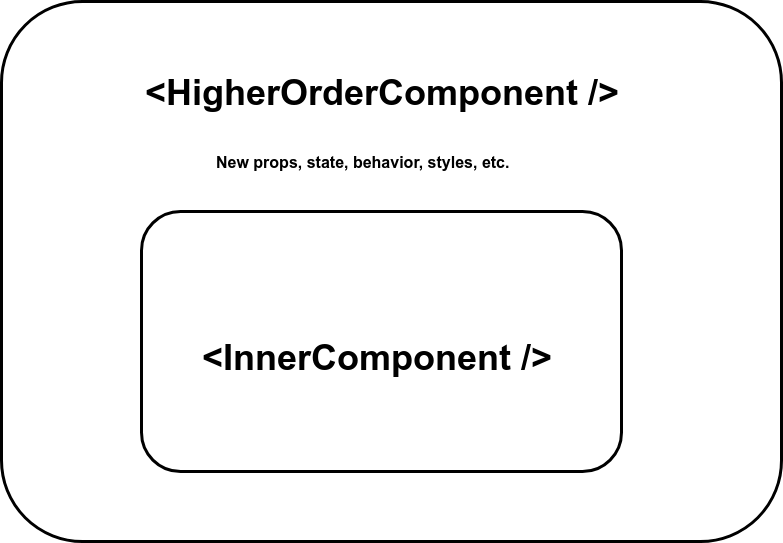

# React Patterns

[tsevdos.me](https://tsevdos.me/) / [@tsevdos](https://twitter.com/tsevdos)

---

# Agenda

All the content can be found [here](https://github.com/codehub-learn/PF-ReGen-React).

- stateful and stateless Components
- higher-order components (HoC)
- render props
- custom hooks

---

# Rules

Feel free to interrupt me for:

- questions
- relevant comments

---

# Stateful and stateless components

- presentational and container components
- smart and dumb component
- seperation of concerns
- easier to reuse
- better structure
- designer friendly

---

# Stateful components

- are concerned with how things work
- provide the data and behavior to presentational or other container components
- call actions and provide these as callbacks to the presentational components
- connect with stores (redux, mobx, etc.)

---

# Stateless components

- simple
- are concerned with how things look (UI)
- event handling
- JSX
- performance

---

# Stateful and stateless components

Examples.

---

# Stateful and stateless components exercise

(./src/examples/SSC/exercise/UserCard.js)

1. Create a UserCardContainer stateful component that will keep all the state and logic
2. Extract the UI to a stateless UserCard component

---

# Higher-order components (HoC)

A higher-order component is a function that takes a component and returns a new component.

A higher-order component (HoC) is an advanced technique in React for reusing component logic. HoCs are not part of the React API, but a pattern that emerges from React’s compositional nature.

---

# Pure functions (functional programming)

- given the same input, will always return the same output

- produce no side effects (ex. API calls, updating DOM, subscribing to event listeners - anything where you want an "imperative" action to happen)

---

# Pure functions

```js
function add(num1, num2) {
  return num1 + num2;
}
const add = (num1, num2) => num1 + num2;
```

---

# Pure functions?

```js
let total = 5;
function add(num1, num2) {
  const result = total + num1 + num2;
  return result;
}

//---------------
function add(num1, num2) {
  console.log(num1, num2);
  return num1 + num2;
}
```

---

# Currying (functional programming)

Is the process of transforming a function that takes multiple arguments into a series of functions that take one argument at a time.

---

# Currying

```js
// Sum function
const sum = function (a, b) {
  return a + b;
};

// Curried sum function
const curriedSum = function (a) {
  return function (b) {
    return a + b;
  };
};

const result1 = sum(2, 3); // 5
const result2 = curriedSum(2)(3); // 2 + 3 // 5
```

---

# Currying

```js
// Sum function
const sum = (a, b) => a + b;

// Curried sum function
const curriedSum = (a) => (b) => a + b;

const result1 = sum(2, 3); // 5
const result2 = curriedSum(2)(3); // 2 + 3 // 5

const addTwo = curriedSum(2); // 2 + b
const result3 = addTwo(5); // 7
```

---

# Higher-order function (functional programming)

A higher order function is a function that either takes one or more functions as arguments or returns a function as its result or both.

---

# Higher-order function

```js
/// normal function
function add(x, y) {
  return x + y;
}

// HoF
function higherOrderFunction(x, callback) {
  return callback(x, 5);
}

higherOrderFunction(10, add);
```

---

# Higher-order function

```js
// normal functions
const add = (...values) => values.reduce((a, b) => a + b);
const multiply = (...values) => values.reduce((a, b) => a * b);

// Calculator (higher-order function)
const calculator = (command) => (...args) => command(...args);

const addition = calculator(add);
const multiplication = calculator(multiply);

const total = addition(3, 6, 9, 12, 15, 18); // 63
const otherTotal = multiplication(2, 4, 3); // 24
```

---

# What higher-order components (HoC) can do?

- code reuse, logic and bootstrap abstraction
- render highjacking
- state and props abstraction and manipulation

---

# Higher-order components (HoC)

```jsx
const EnhancedComponent = (InputComponent) => {
  return EnhancedComponent;
};

// or simply
const EnhancedComponent = (InputComponent) => EnhancedComponent;
```

---

### Higher-order component (HoC)



---

# Higher-order components (HoC)

Examples.

---

# Higher-order components exercise

(./src/examples/HoC/exercise/UserCard.js)

- create a HoC "withUser()"
- keep the same functionality
- the HοC will fetch the user data and pass them to the "enhanced" component as props
- make the "Card" component stateless
- Use it as: <Card title="My card" />

---

## Higher-order components considerations

- a HoC should be a pure function with no side-effects. It should not make any modifications and just compose the original component by wrapping it in another component
- do not use HoC’s in the render method of a component. Access the HoC outside the component definition
- refs are not passed through

---

# Recap

- Stateful and stateless components
- Higher-order components (HoC)

---

# That's all folks

### Questions / Discussions?
